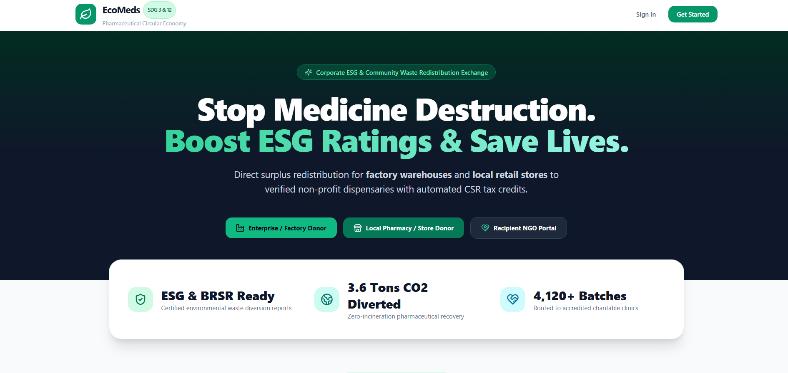
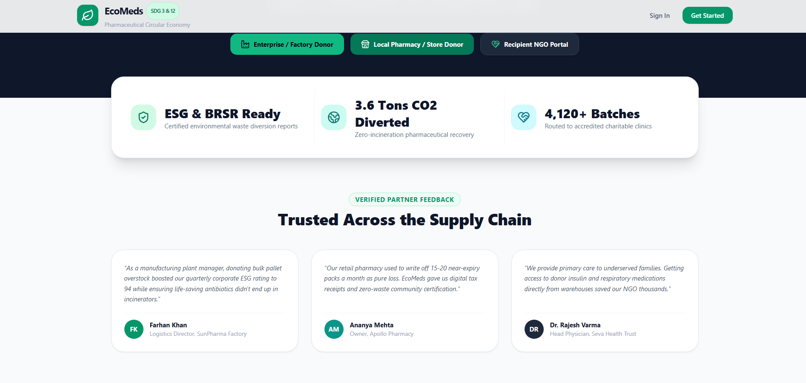
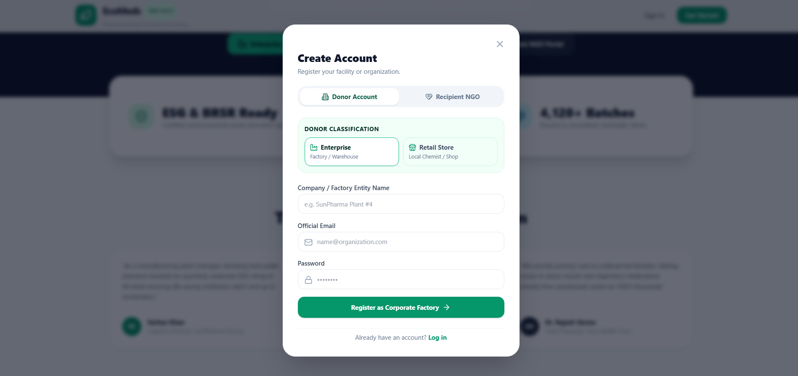
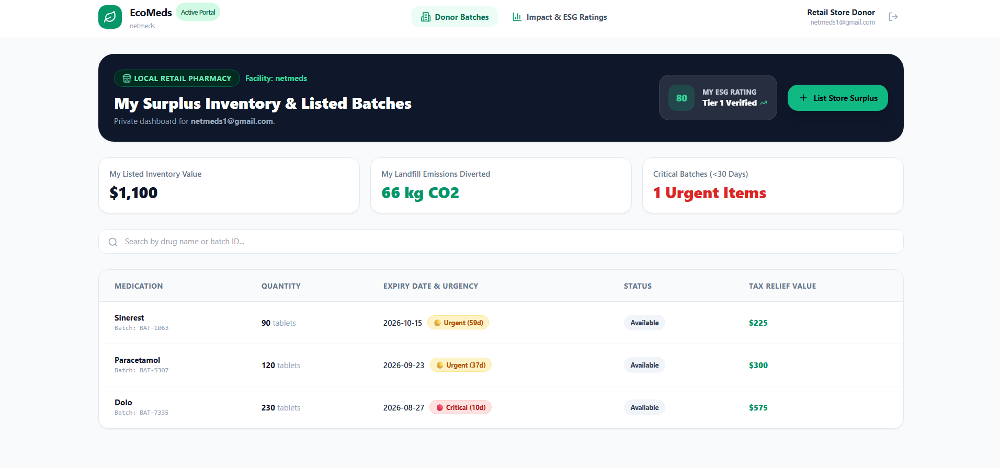
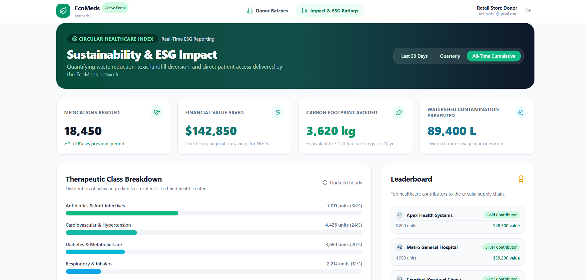
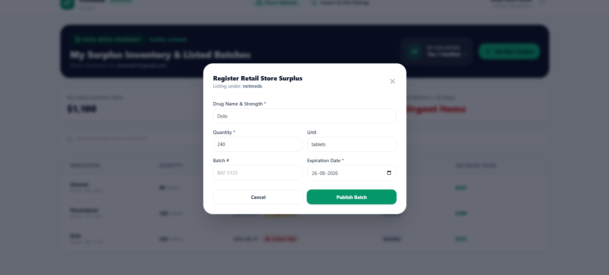
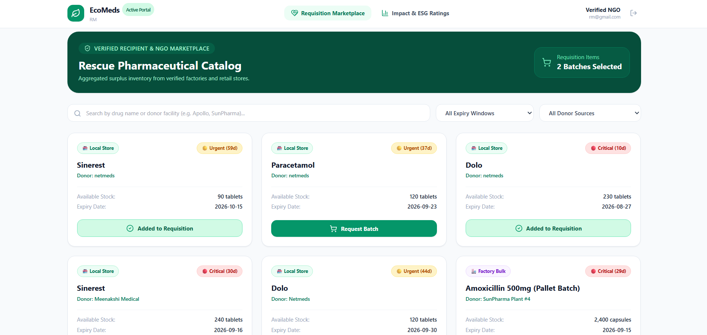
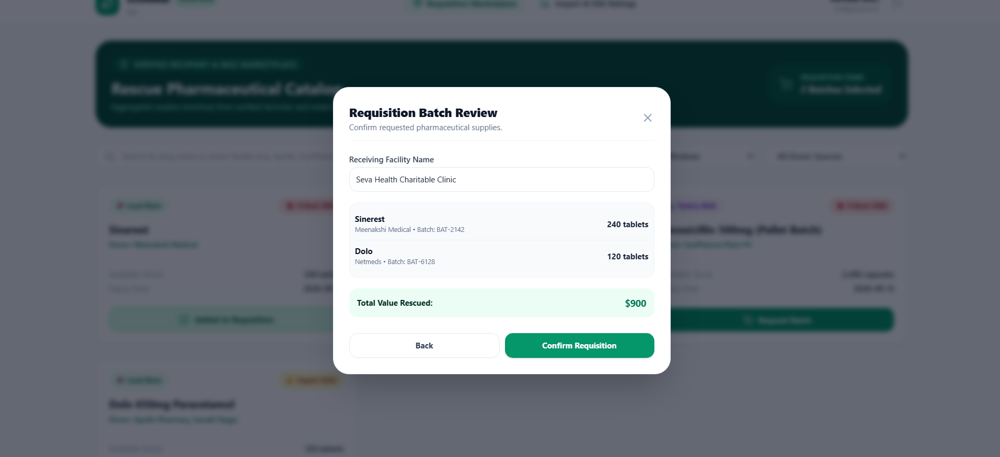
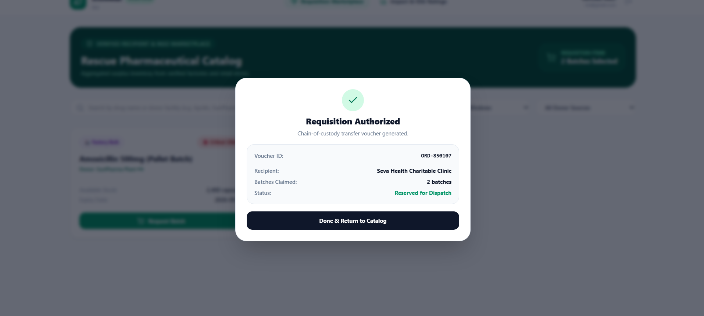

# ♻️ EcoMeds: Circular Pharmaceutical Redistribution Platform

An end-to-end **multi-tenant B2B platform** that reduces pharmaceutical waste by connecting **Enterprise Warehouses** and **Retail Pharmacies** with verified **Non-Profit Organizations (NGOs)**, community clinics, and shelter homes for the redistribution of surplus and near-expiry medicines.

With **Role-Based Access Control (RBAC)**, dynamic expiry categorization, and automated **ESG & CSR analytics**, EcoMeds enables a compliant, transparent, and sustainable pharmaceutical supply chain while supporting **UN SDGs 3 and 12**.

LIVE: https://ecomeds-nine.vercel.app/


---

## Landing Page

> *Circular healthcare portal featuring multi-tenant authentication, ESG metrics, and surplus routing.*

 



---

## Key Features

### 1. Multi-Tenant Role-Based Access Control (RBAC)
- **Enterprise Factory Portal:** Manage bulk pharmaceutical inventory, high-volume batches, and ESG metrics.
- **Retail Pharmacy Portal:** Manage shelf surplus stock and rapid-expiry units.
- **Recipient NGO Marketplace:** Centralized hub where verified clinics, dispensaries, orphanages, and shelter homes can browse and claim available batches.
- **Secure Session Routing:** Verification logic ensuring private logins and role-scoped dashboard views.

### 2. Smart Inventory & Expiry Management
- **Expiry Urgency Categorization:** Medicines are automatically evaluated against shelf-life thresholds:
  - 🔴 **Critical:** Less than 30 days
  - 🟡 **Urgent:** Less than 60 days
  - 🟢 **Eligible:** Less than 90+ days
- **Batch-Level Tracking:** Track batch number, NDC identifiers, category, unit type, and quantities.
- **Tenant Data Isolation:** Scoped inventory access preventing cross-facility data leakage between competing donors.

### 3. Real-Time Requisition Marketplace
- **Smart Filtering:** Dynamic query filtering across drug names, therapeutic categories, donor entities, and facility tiers (Factory vs Retail).
- **Multi-Item Requisition Cart:** NGOs can select multiple batches and place aggregated claim requests.
- **Real-Time Stock Updates:** Automatic state synchronization moving batches from **Available** to **Claimed**.

### 4. ESG & CSR Analytics Engine
- **Emissions Diversion Model:** Automatically calculates landfill $CO_2$ kilograms prevented from incineration and landfill dumping.
- **ESG Scorecard:** Live index evaluating donor circular sustainability compliance.
- **Tax Value Estimation:** Calculates fair-market value assessments for CSR tax relief and audit trails.

---

## Platform Screenshots

### Donor Dashboard (Private Ledger & ESG Score)
> *Tenant-isolated dashboard displaying active batches and corporate sustainability metrics.*



### Surplus Medication Registration Modal
> *Data entry interface for cataloging pharmaceutical surplus and expiry dates.*


### Recipient NGO Requisition Marketplace
> *Aggregated catalog showing available supplies, donor types, expiry categories, and requisition cart.*


### Requisition Cart & Batch Review Modal
> *Review interface for NGOs to verify selected batches, receiving clinics, and total rescued value before confirming claims.*


### Chain-of-Custody Transfer Voucher
> *Digital dispatch receipt generating verified voucher IDs and batch claim confirmations for NGO compliance.*


---

## Architecture & Data Modeling

### Frontend & Build Tools
* **Core Framework:** React 18 with TypeScript for strict type safety
* **Build Tool:** Vite for rapid bundling and hot module replacement
* **Styling:** Tailwind CSS for modular responsive UI
* **Icons:** Lucide React

### State Management & Data Persistence
* **Web Storage API:** Browser `localStorage` engine managing persistent user records, isolated donor inventory ledgers, and claim transitions.
* **Reactive State:** Scoped React hooks managing dynamic multi-filter searches, reactive cart counters, and modal states.

### Expiry Urgency Categorization
| Tier | Window | Operational Action |
| :--- | :--- | :--- |
| **Critical** | < 30 Days | High-priority flag; expedited redistribution to immediate-need trauma centers and shelter homes. |
| **Urgent** | 30 - 60 Days | Standard requisition matching for high-turnover primary care dispensaries. |
| **Eligible** | 60 - 90+ Days | Standard circular catalog listing for general NGO inventory replenishment. |

---

## System Workflow

1. **Registration & Auth:** Register as an Enterprise Factory, Retail Store, or Recipient NGO.
2. **Batch Upload:** Donors enter medication strength, batch number, unit count, and expiration date.
3. **Private Ledger Tracking:** Donors track individual donation value, environmental offsets, and batch statuses.
4. **Catalog Discovery:** NGOs browse, filter by donor type or category, and add rescue batches to a requisition cart.
5. **Impact Review & Claim:** NGOs confirm batch claims, generating an auditable chain-of-custody transfer voucher.

---

## Getting Started

### Prerequisites
* Node.js (v18+)
* pnpm or npm

### Installation & Local Run
```bash
# 1. Clone repository
git clone [https://github.com/your-username/ecomeds.git](https://github.com/your-username/ecomeds.git)

# 2. Navigate to directory
cd ecomeds

# 3. Install dependencies
pnpm install
# or: npm install

# 4. Start local development server
pnpm run dev
# or: npm run dev
